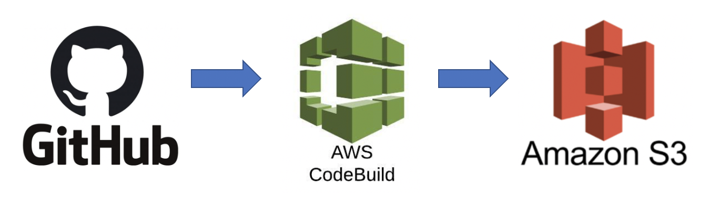
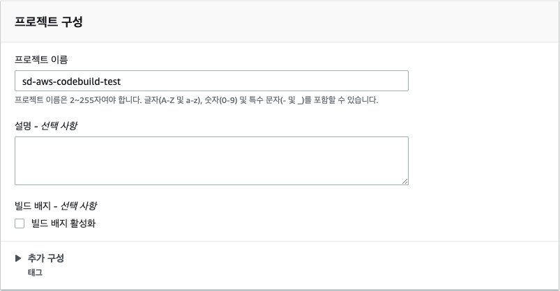

# AWS CodeBuild
보통 CI(Continuous Integration)관리를 위하여 빌드서버를 따로 관리한다.
(예를 들어 빌드용 서버에 젠킨스를 설치해서 사용)<br>
AWS CodeBuild를 통해 별도 서버구성 없이 CI를 진행할 수 있다.

> `github`에서 소스를 가져와서 `AWS CodeBuild`를 통해 빌드하고 생성한 zip파일을 `AWS S3`에 올리기까지 진행해본다.

<br><br>
# 세팅
- 아래 진행하는 세팅은 프로젝트 생성 후 얼마든지 수정가능하다.
<br><br><br>
## 프로젝트 이름
- 프로젝트 이름과 설명 입력<br>

<br><br><br>
## 소스공급
- 소스를 어디서 가져올지 선택
- 여기서는 `Github`를 선택<br>

<br><br><br>
- `Github 개인용 엑세스 토큰으로 연결`
- Github에서 액세스 토큰을 발급받아서 입력해야한다.<br>

<br><br><br>
- settings > Developer settings > Personal access tokens > Generate new token 에서 토큰을 생성한다.<br>


<br><br><br>
- 토큰을 저장하고 연결할 github repository를 선택해주고 빌드를 원하는 소스버전을 입력한다. 여기서는 master 브랜치로 설정<br>

<br><br><br>
## hook 이벤트
- 추가적으로 hook이벤트를 설정할 수 있다.
- 해당 레파지토리에 특정 이벤트가 발생했을 때 빌드를 유발할 수 있다.<br>
<br><br>
- pr을 생성하면 codebuild를 실행한다.<br>


<br><br><br>
## 빌드환경
- 여기서는 Ubuntu로 진행했고 모든 설정을 default로 진행했다.(런타임, 이미지, 이미지버전, 환경유형)<br>

<br><br><br>
## BuildSpec
- CodeBuild는 소스코드에 직접 포함된 buildspec을 사용해서 빌드를 진행
- 본인 프로젝트(스프링부트) 루트경로에 buildspec.yml파일을 추가<br>

<br><br><br>
- 
    - artifacts: 빌드결과파일
        - files: zip파일로 묶을 대상, 예를 들어 `**/*`로 지정하면 프로젝트 전체가 다 zip파일에 포함된다.
        - names: zip파일 이름(콘솔에서 `의미 체계 버전 관리 활성화` 체크하면 이 이름으로 생성)
    - [buildspec 공식 DOC](https://docs.aws.amazon.com/ko_kr/codebuild/latest/userguide/build-spec-ref.html)
<br><br><br>
```yaml
version: 0.2

phases:
  build:
    commands:
      - echo Build Starting on `date`
      - chmod +x ./gradlew
      - ./gradlew build
  post_build:
    commands:
      - echo $(basename ./build/libs/*.jar)
      - pwd
artifacts:
  files:
    - build/libs/*.jar
  name: myname-$(date +%Y-%m-%d_%H:%M:%S)
  discard-paths: yes
cache:
  paths:
    - '/root/.gradle/caches/**/*'
```
- [discard-paths]에 yes값을 줘서 해당 빌드결과파일이 s3로 업로드 될 때 [files]에 기술된 path(build/libs)는 무시되고 파일명으로만 업로드 될 수 있도록 할 수 있다.
    - 이게 없으면 zip파일에 buil/libs/빌드결과.jar 가 들어있는데 이게 있으면 zip파일에 빌드결과.jar가 바로 들어있다.
- cache
    - maven이나 gradle 의존성을 빌드때마다 내려받지 않고 cache해서 가져오는 기능
    - 여기에 지정된 위치의 파일들을 S3에 캐시파일로 등록
    - gradle의 경우 /root/.gradle/caches/**/*에 다운받은 의존성 파일들이 있기 때문에 이 위치를 캐시영역으로 지정
    - maven: '/root/.m2/**/*'
<br><br><br>
## 아티팩트

- 빌드결과를 보관할 위치를 선택할 수 있다.
- 여기서는 S3로 지정을 했고 내 `S3 버킷`(sd-codebuild)로 지정했다.
- 빌드결과 파일이름은 buildspec.yml에서 지정하려고 하기 때문에 `의미 체계 버전 관리 활성화`를 체크한다.
    - 여기서 체크안하고 이름을 지정하면 이 이름으로 빌드결과가 만들어지기 때문에 만약 저장할 경로까지 똑같다면 계속 덮어쓰는 문제가 발생한다.
- 빌드결과가 저장될 경로를 지정할 수 있다.
    - 여기서는 sd-codebuild s3 버킷 `path 디렉토리`에 저장
- 네임스페이스 유형에서 빌드ID를 선택하면 저장경로에 빌드ID가 추가된다.
    - 현재는 path/빌드결과 이지만 path/빌드ID/빌드결과 로 경로중간에 한 뎁스가 추가된다.
<br><br><br>
## 로그
- 빌드로그를 관리할 수 있다.
- 추후 CloudWatch에 업로드 예정. 현재는 설정없이 진행<br>

<br><br><br>
## 생성완료

<br><br><br>
## 빌드진행
- 원하는 소스버전을 입력
- 빌드 환경변수도 입력할 수 있다.<br>

<br><br><br>
- 진행중<br>


- 완료<br>

- s3 업로드<br>

<br><br><br>
## 시행착오
- 프로젝트 이름을 잘못 설정하거나 서비스 역할이름 설정에서 오류가 있을 경우 에러메시지가 좀 명확하지 않은것 같다.
엉뚱한(?) 에러메시지가 노출되서 이것저것 다시 고쳐가면서 해결했다.
- 빌드 결과가 s3에 안올라간적이 있었는데 buildspec.yml 파일에 artifacts 부분을 누락했었다. [reference](https://stackoverflow.com/questions/53809090/codebuild-does-not-upload-build-artifact-to-s3)
- [reference](https://twofootdog.tistory.com/37)
- [reference](https://lemontia.tistory.com/945)
- [reference](https://jojoldu.tistory.com/282)

        


