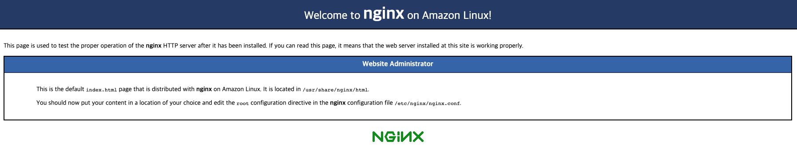

# AWS EC2 세팅
- EC2 생성 > OS Amazon Linux로, ubuntu로 만드니까 yum이 안깔려있음

## Java 11 설치
- [reference](https://pompitzz.github.io/blog/java/awsEc2InstallJDK11.html#jdk-%EC%84%A4%EC%B9%98)
- yum에는 설치가능한 JDK가 1.8까지만 존재하기 때문에 JDK 11을 설치하기 위해선 다른 방법을 이용
```shell script
# aws coreetto 다운로드
sudo curl -L https://corretto.aws/downloads/latest/amazon-corretto-11-x64-linux-jdk.rpm -o jdk11.rpm

# jdk11 설치
sudo yum localinstall jdk11.rpm

# jdk version 선택
sudo /usr/sbin/alternatives --config java

# java 버전 확인
java --version

# 다운받은 설치키트 제거
rm -rf jdk11.rpm
```
<br><br><br>
## Java 환경변수 설정
- [reference](https://gaemi606.tistory.com/127)
- 아래 입력 후 아무 응답이 없으면 환경변수가 설정되지 않음을 의미
```shell script
echo $JAVA_HOME
```
- 절대 경로를 알아낸 뒤 복사
```shell script
which java
/usr/bin/java

readlink -f /usr/bin/java
/usr/lib/jvm/java-11-amazon-corretto/bin/java
```
- vi편집기 접근
```shell script
sudo vi /etc/profile
```
- 환경변수 설정(파일 맨아래에 추가)
```shell script
export JAVA_HOME=/usr/lib/jvm/java-11-amazon-corretto/bin/java
export PATH=$PATH:$JAVA_HOME/bin
export CLASSPATH=$JAVA_HOME/jre/lib:$JAVA_HOME/lib/tools.jar
```
- 적용확인
```shell script
source /etc/profile
echo $JAVA_HOME
```
<br><br>
## 타임존 변경
- [reference](https://jojoldu.tistory.com/513)
- root 계정으로 변경
```shell script
sudo su - root
```
- 타임존 변경
```shell script
sudo rm /etc/localtime
sudo ln -s /usr/share/zoneinfo/Asia/Seoul /etc/localtime
```
- 추가로 이 설정을 안하면 인스턴스를 재시작하면 UTC로 롤백됨
- 아래 파일을 열어 `ZONE을 Asia/Seoul`로 수정
```shell script
vi /etc/sysconfig/clock
```
- 재시작!
```shell script
reboot
```
<br><br>
## 호스트네임변경
- 여러 서버를 관리 중일 경우 IP만으로 어떤 서비스의 서버인지 확인이 어렵다.
- 각 서버가 무슨 서비스인지 표현하기 위해 호스트네임을 변경

- 책대로 했는데 변경이 안되서 [공식DOC](https://docs.aws.amazon.com/ko_kr/AWSEC2/latest/UserGuide/set-hostname.html)을 참고함
<br><br>
## nginx 설치
- Amazon Linux 2에서는 `yum`을 통한 nginx 설치가 지원되지 않음
    ```shell script
    sudo yum install nginx
    ```
  <br>
- yum으로 설치 시 에러 발생<br>

<br><br><br>
- `amazon-linux-extras`로 설치
    ```shell script
    sudo amazon-linux-extras install nginx1
    ```
  <br>
- 버전확인
    ```shell script
    nginx -v
    ```
    
    <br><br>
- nginx 시작
    ```shell script
    sudo service nginx start
    ```
  <br>
- nginx 접속확인
- `IPv4 퍼플릭 IP`로 접근 > 인스턴스 80포트가 열려있어야함<br>

<br><br><br>
## nginx 설정
- nginx 설정파일 기본경로
    ```shell script
    sudo vi /etc/nginx/nginx.conf
    ```
  <br>
#### 리버스 프록시 설정
- 모든 요청은 nginx가 받아서 스프링부트(8080)으로 전달
    ```shell script
    server {
           ...
           listen 80;
           ...
  
           location / {
              proxy_set_header Host $http_host;
              proxy_set_header X-Forwarded-For $http_x_forwarded_for;
              proxy_set_header X-Real-IP $remote_addr;
              proxy_pass http://127.0.0.1:8080;
           }
           ...
    } 
    ```
<br><br>
#### 로그설정
- 기본로그설정으로 액세스로그가 전역설정이 되어있다.
- 가상 호스트에서 별도 액세스 로그를 설정하지 않을 경우 모든 액세스 로그가 한곳에 모이기 때문에 추후 로그분석 시 번거로움
    ```shell script
    http {
         ...
         log_format  main  '$remote_addr - $remote_user [$time_local] "$request" '
                          '$status $body_bytes_sent "$http_referer" '
                          '"$http_user_agent" "$http_x_forwarded_for"';
    
         access_log  /var/log/nginx/access.log  main;
         ...
    }
    ```
    <br>
- 가상 호스트별로 액세스 로그 설정
- 가상 호스트 설정 부분인 `server` 블럭수정, 전역로그주석처리 or 삭제
- 로그 경로는 원하는대로 가져가도 무방
    ```shell script
    http {
         ...
         #access_log  /var/log/nginx/access.log  main;
         server {
               ...
               access_log /home/ec2-user/log/nginx/myservice/access.log main;
               error_log /home/ec2-user/log/nginx/myservice/error.log;
               ...
         }
         ...
    }
    ```
<br><br><br>
#### logrotate 설정
- [reference](https://longtermsad.tistory.com/11)
- [reference](https://extrememanual.net/10139)
- nginx logrotate 경로
    ```shell script
    sudo vi /etc/logrotate.d/nginx
    ```
    <br>
- 내가 설정한 nginx log파일경로
- 여러 가상호스트가 nginx 밑에 있을수도 있어서 `nginx/*/`로 지정함
    ```shell script
    /home/ec2-user/log/nginx/*/*.log {
         create 644 root root
         copytruncate
         daily
         rotate 60
         missingok
         dateext
         dateformat -%Y%m%d
    }
    ```
    <br>
- logrotate는 기본적으로 cron.daily에서 호출하게 설정이 되어있지만 직접 crontab에 등록하는 방법도 있다
<br><br><br>
## systemd 설정
- nginx는 설치 시 등록됨
    ```shell script
    sudo vi /usr/lib/systemd/system/nginx.service
    ```
  <br>
- 스프링부트 어플리케이션 service 추가
    ```shell script
    sudo vi /usr/lib/systemd/system/myservice.service
    ```
    ```shell script
    [Unit]
    Description=Myservice Server
    After=syslog.target network.target remote-fs.target nss-lookup.target
    
    [Service]
    User=ec2-user
    Group=ec2-user
    Type=forking
    WorkingDirectory=/home/ec2-user/build
    ExecStart=/home/ec2-user/build/start.sh
    ExecReload=/home/ec2-user/build/start.sh
    ExecStop=/home/ec2-user/build/stop.sh
    
    [Install]
    WantedBy=multi-user.target
    ```
  <br>
- enable service
    ```shell script
    sudo systemctl enable nginx.service
    sudo systemctl enable myservice.service
    sudo systemctl daemon-reload 
    ```