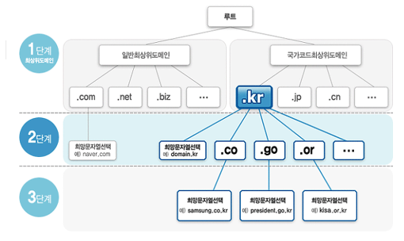
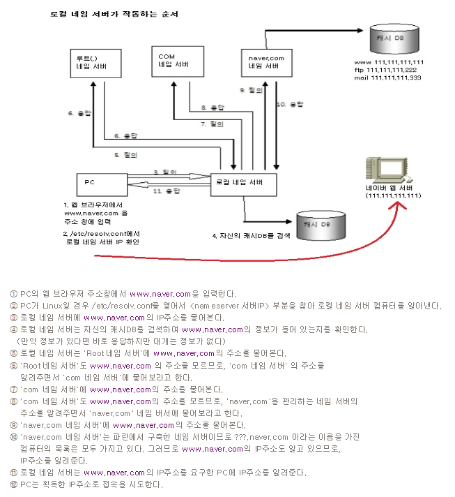

# DNS
- [reference](https://yang1650.tistory.com/21)
- [reference](https://kimhyun2017.tistory.com/37)
- 도메인 이름을 IP주소로 변환시켜주는 역할
- 초창기 인터넷에서는 1대의 DNS만으로도 관리가 충분
- 인터넷이 확장하면서 컴퓨터가 기하급수적으로 늘어났고 몇대의 네임서버만으로는 관리가 불가능
- 트리 구조 형태 도메인 이름 체계를 고안
  
- 도메인 이름 체계
    - 
    - Root name server : com, net, org, kr 등의 1단계 네임서버만 관리
    - 1단계 name server : google, naver 등의 2단계 네임서버만 관리
    - 2단계 name server : www, ftp, mail 서버등을 관리
  
- 로컬 네임 서버
    - /etc/resolv.conf에 저장된 네임 서버를 로컬 네임 서버라고 한다.
    - 로컬 네임 서버는 자신이 알고 있는 도메인 이름은 바로 알려주고 모르는 경우는 다음 작업을 수행한다.
    - 
