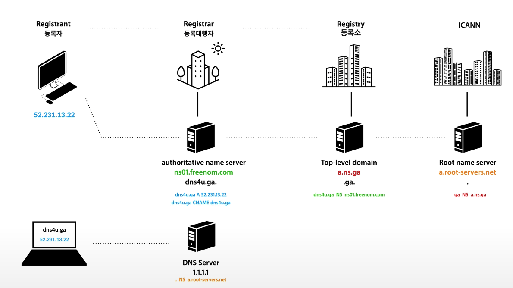
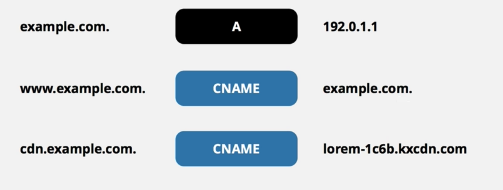

# DNS
- [reference](https://yang1650.tistory.com/21)
- [reference](https://kimhyun2017.tistory.com/37)
- [reference](https://www.youtube.com/watch?v=N_T_vhUsn1A)
- 도메인 이름을 IP주소로 변환시켜주는 역할
- 초창기 인터넷에서는 1대의 DNS만으로도 관리가 충분
- 인터넷이 확장하면서 컴퓨터가 기하급수적으로 늘어났고 몇대의 네임서버만으로는 관리가 불가능
- 트리 구조 형태 도메인 이름 체계를 고안
  
# 도메인 이름 체계

- Root name server : com, net, org, kr 등의 1단계 네임서버만 관리
- 1단계 name server : google, naver 등의 2단계 네임서버만 관리
- 2단계 name server : www, ftp, mail 서버등을 관리
  
# 로컬 네임 서버
- /etc/resolv.conf에 저장된 네임 서버를 로컬 네임 서버라고 한다.
- 로컬 네임 서버는 자신이 알고 있는 도메인 이름은 바로 알려주고 모르는 경우는 다음 작업을 수행한다.

  
# DNS record
- DNS record
    - DNS 서버에 저장하는 도메인 이름에 대한 정보 한건 한건
    - A : 도메인에 대한 IP주소를 매핑
    - cname : 해당 도메인에 대한 별명을 지정
    - NS : 도메인을 관리하는 네임서버를 지정
  

- dns4u.ga A 52.231.13.22 : dns4u.ga `도메인에 대한 IP`가 52.231.13.22다
- dns4u.ga NS ns01.freenom.com : dns4u.ga `도메인을 관리하는 네임서버`는 ns01.freenom.com이다
- 위 예제를 보면
    1. 루트 네임서버에 ga NS a.nsga 레코드가 저장되어있다.
        - ga 도메인은 a.ns.ga 네임서버가 관리한다.
    2. 탑레벨 네임서버에 dns4u.ga NS ns01.freenom.com 레코드가 저장되어있다.
        - dns4u.ga 도메인은 ns01.freenom.com 네임서버가 관리한다.
    3. authoritative 네임서버에 dns4u.ga A 52.231.13.22 레코드가 저장되어있다.
        - dns4u.ga 도메인의 IP주소는 52.231.13.22다.
- 특정 도메인에 대한 IP로 접근하기까지, 최상위 네임서버부터 시작해 해당네임서버에 등록된 레코드를 통해 다음 행선지로 이동한다.
- NS를 통해 다른네임서버로 계속 튕기다가 A 를 만나서 IP를 얻어 접근한다.
  

- example.com에 대한 별명을 cname으로 www.example.com을 지정
- www.example.com으로 접속하면 example.com으로 연결
    