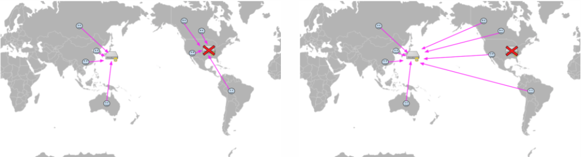
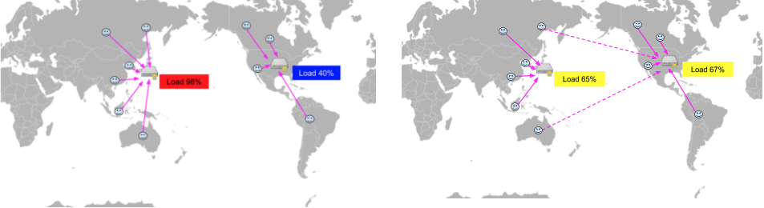
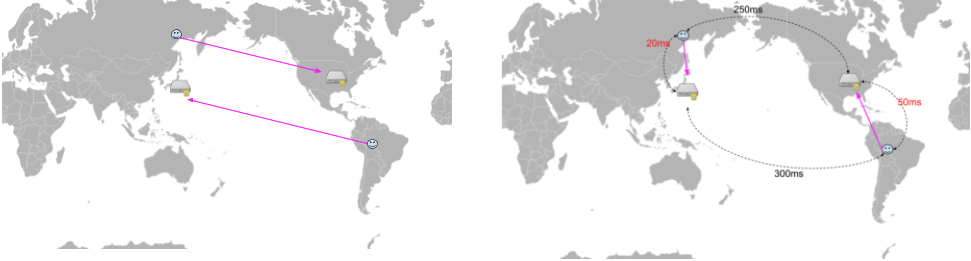
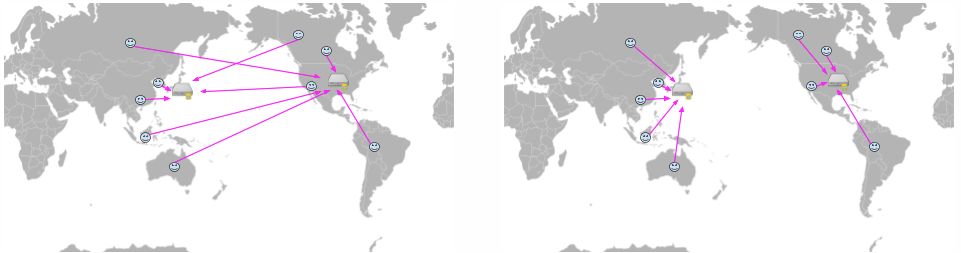
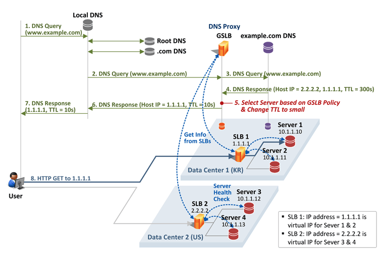

# GSLB
- 사내에서 `DR`구성을 진행하며 사용한 `GSLB`에 대해 정리해본다.
- [reference](https://www.netmanias.com/ko/post/blog/5620/dns-data-center-gslb-network-protocol/global-server-load-balancing-for-enterprise-part-1-concept-workflow)
- [reference](https://www.joinc.co.kr/w/man/12/GSLB)
- [reference](https://nesoy.github.io/articles/2020-01/GSLB)
- 정의
    - DNS 서비스의 발전된 형태
    - DNS가 도메인에 해당하는 IP주소를 반환할뿐 네트워크 지연, 성능, 트래픽 유입, 헬스체크 등은 전혀 고려하지 않는다.
    - 예를 들어 
        1. 구글서버가 죽어있는 상태
        2. 사용자가 www.google.com 접속시도
        3. DNS 서버는 www.google.com 도메인에 해당하는 IP(216.58.193.78) 반환
        4. 사용자는 반환받은 IP(216.58.193.78)로 접속시도
        5. 서버가 죽었기때문에 접속실패
        - 즉, DNS 서버는 해당서버에 대한 헬스체크가 없기 때문에 사용자를 죽어있는 서비스로 안내할수도 있다.
  
- DNS와 GSLB 비교
    - 재해복구

        - DNS는 서버의 상태를 알 수 없기 때문에 서비스를 실패하는 유저가 생길 수 있다.
        - GSLB는 서버의 상태를 모니터링 한다. 헬스체크가 실패한 서버는 제외하므로 유저는 서비스를 계속 이용할 수 있다
  
    - 로드밸런싱

        - DNS는 Round Robin 방식을 사용하기 때문에 정교한 로드밸런싱이 어렵다.
        - GSLB는 서버의 로드를 모니터링한다. 로드가 적은 서버의 IP를 반환하는 식으로 정교한 로드밸런싱을 할 수 있다.
  
    - 레이턴시 기반

        - DNS는 Round Robin 방식을 사용한다. 유저는 네트워크상에서 멀리 떨어진 위치의 서버로 연결 할 수도 있다.
        - GSLB는 각 지역별로 서버에 대한 레이턴시 정보를 가지고 있다. 유저가 접근을 하면, 유저의 지역으로 부터 가까운(더 작은 레이턴시를 가지는)서버로 연결한다.
  
    - 위치기반

        - DNS에서 유저는 Round Robin하게 서버로 연결된다.
        - GSLB는 유저의 지역정보를 기반으로 해당 지역을 서비스하는 서버로 연결 할 수 있다.
  
- 동작 프로세스
 
    - GSLB는 Local name server와 Second Level name server 사이에 위치한다.
        1. 사용자가 www.example.com에 접속하기 위해 Local DNS 서버로 DNS Query를 보내고, Local DNS 서버는 Root DNS, .com DNS 서버(Top Level name server)를 거쳐
        2. GSLB로 www.example.com에 대한 DNS Query를 보낸다.
        3. GSLB는 DNS Proxy로 동작하며, 이 DNS Query를 그대로 example.com DNS 서버(Second Level name server)로 전달한다.
        4. example.com DNS 서버는 www.example.com에 대한 IP주소 1.1.1.1과 2.2.2.2가 미리 등록되어 있어 그 값을 GSLB로 전달한다.
        5. GSLB는 나름의 정책을 통해 1.1.1.1과 2.2.2.2 중에 사용자를 위한 최적의 IP를 결정
        6. GSLB를 통해 결정된 IP는 Local DNS로 전달되고
        7. Local DNS는 사용자 단말에게 그 값을 전달
        8. 사용자는 전달받은 IP를 목적지로 하여 요청을 보냄
        
