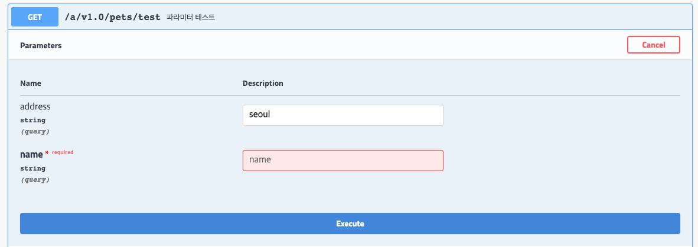
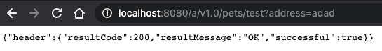

# Swagger Annotation 정리
- [reference](https://www.baeldung.com/swagger-apiparam-vs-apimodelproperty)
- [reference](https://lng1982.tistory.com/314)
- [reference](https://velog.io/@sa833591/Swagger-API-%EB%AC%B8%EC%84%9C-%EC%9E%90%EB%8F%99%ED%99%94)
- @Api: Controller 단위로 API 메타데이터 명시
    - tags: 스웨거 컨트롤러 노출명
- @ApiOrientation: 하나의 REST API 요청 URL에 매핑
    - value: Api 이름
- @ApiParam, @ApiImplicitParam: 보통 request로 들어오는 요청파라미터에 대한 설명
- @ApiModelProperty: 요청, 응답 DTO Class 필드에 대한 설명
- @ApiModel은 안붙여도 스웨거 model에 알아서(?) 반영되는 것 같다.
<br><br>
- 아래는 같은 메소드에 대해서 각각 @ApiParam, @ApiImplicitParam으로 표현한 예
```java
@RestController
@RequiredArgsConstructor
@RequestMapping("/api/v1.0/members")
@Api(tags = "회원 컨트롤러")
public class MemberController {
        .
        .
        .
    @GetMapping("/{id}")
    @ApiOrientation(value = "회원 단건 조회")
    public MemberDTO getMember(
        @ApiParam(name ="id", required = true, value = "uuid") @PathVariable Long id,
        @ApiParam(name = "name", required = true, value = "이름") @RequestParam String name,
        @ApiParam(name = "address", required = false, value = "이름") @RequestParam(required = false) String address) {
        return memberService.getMember(name, address, email);
    }
    
    @GetMapping("/{id}")
    @ApiOrientation(value = "회원 단건 조회")
    @ApiImplicitParams({
        @ApiImplicitParam(name = "id", value = "uuid", required = true, dataType = "long", paramType = "path"),
        @ApiImplicitParam(name = "name", value = "이름", required = true, dataType = "string", paramType = "query"),
        @ApiImplicitParam(name = "address", value = "주소", required = false, dataType = "string", paramType = "query")
    })
    public MemberDTO getMember(
        @PathVariable Long id,
        @RequestParam String name,
        @RequestParam(required = false) String address) {
        return memberService.getMember(name, address, email);
    }
}

@Data
@NoArgsConstructor
@AllArgsConstructor
public class MemberDTO {
    
    @ApiModelProperty(value = "이름")
    private String name;
    @ApiModelProperty(value = "이메일")
    private String email;
    @ApiModelProperty(value = "주소")
    private String address;
    @ApiModelProperty(value = "나이")
    private Integer age;
}
```
<br><br>
***
- 스웨거 노출과 실제 파라미터 required 비교 
```java
public enum Country{
    KR, JP
}

public CommonResponse test(
      @ApiParam(required = true) @RequestParam String name,
      @ApiParam(required = true) @RequestParam(required = false) String address,
      @ApiParam(required = false) @RequestParam Country country,
      @RequestParam Long id){
    
      return CommonResponse.ok();
}
```
- @ApiParam은 '스웨거' 어노테이션이기 때문에 스웨거를 위해서만 동작한다. 아래에서 required는 스웨거상 표기여부이다.
    1. @RequestParam : required O
    2. @RequestParam(required = false) : required X
    3. @ApiParam(required = true) @RequestParam(required = false) : required O
    4. @ApiParam(required = false) @RequestParam(required = true) : required X
- 4의 경우, 스웨거테스트는 해당 파라미터값 없이도 진행가능하나 서버로부터 400응답을 받는다.(실제는 true, 스웨거상 노출만 false)
<br><br><br>
***
- 스웨거 에러표시와 실제호출 차이
```java
@ApiOperation(value = "valid 테스트")
@GetMapping("/test")
public CommonResponse test(@ModelAttribute Req req) {
    return new CommonResponse(ResultCode.SUCCESS);
}

@Data
@NoArgsConstructor
@AllArgsConstructor
public class Req {

    @ApiModelProperty(required = true)
    private String name;
    private String address;
}
```

<br>
- Req Class에 @ApiModelProperty(required = true)로 인해서 스웨거에서 테스트를 진행할때 해당 파라미터가 없으면 빨간테두리로 에러가 표시된다
<br><br>

- 하지만 스웨거테스트가 아닌 실제 호출을 `name`없이 보내면 성공한다
- 스웨거 어노테이션은 스웨거에서만 유효하기 때문에 당연한 결과이다
```java
.
.
public CommonResponse test(@Valid @ModelAttribute Req req)
.
.
public class Req {

    @ApiModelProperty(required = true)
    @NotNull
    private String name;
.
.

```
- 메소드에 `@Valid` 추가, name 필드에 `@NotNull` 추가
####스웨거는 API명세 문서화를 도와줄 뿐, 실제로 기능을 담당하진 않기 때문에 실제 기능을 완성하고 필요한 부분에 스웨거 어노테이션을 달아서 문서를 만드는 것!    