# 단위 테스트

## 2. 단위 테스트란 무엇인가?
### 2.1.1 격리 문제에 대한 `런던파`의 접근
- 클래스의 모든 의존성은 테스트 대역으로 대체됐기 때문에, 테스트가 실패하면 확실하게 테스트 대상 시스템(SUT)가 고장남을 알 수 있다
- SUT의 의존성을 테스트 대역으로 대체하면, 객체 그래프를 분할할 수 있다
    - 그래프를 효과적으로 분해해 단위 테스트에서 준비를 크게 줄일 수 있다
```java
public void Purchase_succeeds_when_enough_inventory() {
    
    // 준비
    var storeMock = new Mock<ISTORE>();
    storeMock
            .Setup(x => x.HasEnoughInventory(Product.Shampoo, 5))
            .Returns(true);
    var customer = new Customer();
    
    // 실행
    bool success = customer.Purchase(
            storeMock.Object, Product.Shampoo, 5);

    // 검증
    Assert.True(success);
    storeMock.Verify(
        x => x.RemoveInventory(Product.Shampoo, 5),
        Times.Once);
}
```
- `Mock`을 사용해 대체

### 2.1.2 격리 문제에 대한 `고전파`의 접근
```java
public void Purchase_succeeds_when_enough_inventory() {
    
    // 준비
    var store = new Store();
    store.AddInventory(Product.Shampoo, 10);
    var customer = new Customer();
    
    // 실행
    bool success = customer.Purchase(store, Product.Shampoo, 5);

    // 검증
    Assert.True(success);
    Assert.Equal(5, store.GetInventory(Product.Shampoo));
}
```
- Mock을 사용하지 않고 `운영용 인스턴스`를 사용
- `Customer`, `Store` 둘 다 검증

### 공유 의존성
- 테스트 간에 공유되고 서로의 결과에 영향을 미칠 수 있는 수단을 제공하는 의존성
- 정적 가변 필드, 데이터베이스 등
### 비공개 의존성
- 공유하지 않는 의존성
- Configuration Class 등


## 2.2 단위 테스트의 런던파와 고전파

|-|격리 주체|단위의 크기|테스트 대역 사용 대상|
|---|---|---|---|
|런던파|단위|단일 클래스|불변 의존성 외 모든 의존성|
|고전파|단위 테스트|단일 클래스 또는 클래스 세트|공유 의존성|
### 2.2.1 고전파와 런던파가 의존성을 다루는 방법


|-|의존성 종류|
|---|---|
|데이터 베이스|공유 의존성|
|Store 인스턴스|변경 가능한 비공개 의존성|
|Product 인스턴스|불변 비공개 의존성(값 객체, Value Object)|


- 읽기 전용 API 서비스는 공유 의존성이 아니다
    - 쓰기 API 서비스는 공유 의존성이다

## 2.3 고전파와 런던파 비교
### 2.3.1 한 번에 한 클래스만 테스트하기
> 좋은 테스트는 `단일 동작 단위`를 검증해야 한다<br>
> 테스트는 해결하는 데 도움이 되는 문제에 대한 이야기를 들려줘야 한다<br>
> 이 이야기는 프로그래머가 아닌 `일반 사람들`에게 응집도 높고 의미가 있어야 한다

- 테스트는 코드의 단위를 검증해서는 안 된다
- `동작의 단위`, 즉 문제 영역에 의미가 있는 것, 이상적으로는 비즈니스 담당자가 유용하다고 인식할 수 있는 것을 검증해야 한다
- 동작 단위를 구현하는 데 클래스가 얼마나 필요한지는 상관없다
- 단위는 여러 클래스에 걸쳐 있거나 한 클래스에만 있을 수 있고, 심지어 아주 작은 메소드가 될 수도 있다
- 예
    - 우리집 강아지를 부르면, 바로 나에게 온다
    - 우리집 강아지를 부르면 먼저 왼쪽 앞다리를 움직이고, 이어서 오른쪽 앞다리를 움직이고, 머리를 돌리고, 꼬리를 흔들기 시작한다.....
### 2.3.2 상호 연결된 클래스의 큰 그래프를 단위 테스트하기
- 실제 협력자를 대신해 Mock을 사용하면 클래스를 쉽게 테스트할 수 있다
- 클래스의 직접적인 의존성을 대체해 그래프를 나눌 수 있으며, 이는 단위 테스트에서 준비해야 할 작업량을 크게 줄일 수 있다
<br><br>
> 위는 모두사실이지만, 이 추리 과정은 잘못된 초점을 맞추고 있다
- 상호 연결된 클래스의 크고 복잡한 그래프를 테스트할 방법을 찾는 대신, 먼저 이러한 클래스 그래프를 갖지 않는 데 집중해야 한다
- 대개 클래스 그래프가 커진 것은 코드 설계 문제의 결과다
- Mock을 사용하는 것은 이 문제를 감추기만 할 뿐, 원인을 해결하지 못한다
## 2.4 두 분파의 통합 테스트
- 런던파는 실제 협력자 객체를 사용하는 모든 테스트를 통합 테스트로 간주한다
    - 고전 스타일로 작성된 대부분의 테스트는 런던파 지지자들에게 통합 테스트로 느껴질 것
### 2.4.1 통합 테스트의 일부인 엔드 투 엔드 테스트
- 엔드 투 엔드 테스트가 일반적으로 의존성을 더 많이 포함한다


## 3. 단위 테스트 구조
## 3.1 단위 테스트를 구성하는 방법
### 3.1.1 AAA 패턴 사용
> AAA 패턴은 모든 테스트가 단순하고 균일한 구조를 갖는 데 도움
- 준비
  - SUT와 해당 의존성을 원하는 상태로 만든다
- 실행
  - SUT 메소드를 호출하고 준비된 의존성을 전달
  - 출력이 있다면 출력 값을 캡처
- 검증
  - 반환 값이나 SUT와 협력자의 최종 상태
  - SUT가 협력자에 호출한 메소드
- 검증구절부터 시작
  > TDD를 실천할 떄, 즉 기능을 개발하기 전에 실패할 테스트를 만들 때는 어떻게 동작할지 충분히 알지 못한다<br>
  > 따라서 먼저 기대하는 동작으로 윤곽을 잡은 다음, 이 기대에 부응하기 위한 시스템을 어떻게 개발할지 아는 것이 좋다
- 준비구절부터 시작
  > 제품 코드를 작성한 후에 테스트를 작성한다면 테스트를 작성할 시점에 실행에서 무엇을 예상하는지 이미 알고 있으므로 준비 구절부터 시작하는 것이 좋다
### 3.1.2 여러 개의 준비, 실행, 검증 구절 피하기
> 여러 개의 준비, 실행, 검증 구절은 테스트가 너무 많은 것을 한 번에 검증한다는 의미<br>
> 이러한 테스트는 여러 테스트로 나눠서 해결
- 실행이 하나면 테스트가 단위 테스트 범주에 있게끔 보장하고, 간단하고, 빠르며, 이해하기 쉽다
- 통합 테스트에서는 실행 구절을 여러 개 두는 것이 괜찮을 때도 있다
### 3.1.3 테스트 내 if 문 피하기
- 단위 테스트든 통합 테스트든 분기가 없는 간단한 일력의 단계여야 한다
### 3.1.4 각 구절은 얼마나 커야 하는가?
- 일반적으로 준비 구절이 세 구절 중 가장 크다
  - 준비 구절이 많이 크면, 별로로 도출하는 것이 좋다
- 실행 구절은 보통 코드 `한 줄`이다
  ```java
  public void Purchase_succeeds_when_enough_inventory() {
      
      // 준비
      var store = new Store();
      store.AddInventory(Product.Shampoo, 10);
      var customer = new Customer();
      
      // 실행
      bool success = customer.Purchase(store, Product.Shampoo, 5);
      store.RemoveInventory(success, Product.Shampoo, 5);
  
      // 검증
      Assert.True(success);
      Assert.Equal(5, store.GetInventory(Product.Shampoo));
  }
  ```
  - 위 테스트의 문제점은 단일 작업을 수행하는 데 `두 개`의 메소드 호출이 필요하다는 것
  - 비즈니스 관점에서 구매가 `정상`적으로 이뤄지면 `고객의 제품 획득`과 `매장 재고 감소`라는 `두 가지` 결과를 얻는다
  - 이 결과는 `같이` 만들어야 하고, 이는 다시 단일한 메소드가 있어야 한다는 뜻
  - `코드 캡슐화`를 항상 지켜서 해결할 수 있다
### 3.1.5 검증 구절에는 검증문이 얼마나 있어야 하는가
- 단위 테스트의 단위는 `동작의 단위`이지 코드의 단위가 아니다
  - 단일 동작 단위는 여러 결과를 낼 수 있으며, 하나의 테스트로 그 모든 결과를 평가하는 것이 좋다
### 3.1.6 테스트 대상 시스템 구별하기
- SUT과 의존성을 구분
- 테스트 내 SUT 이름을 `sut`로 하라
## 3.3 테스트 간 테스트 픽스처 재사용
> `준비` 구절에서 코드를 재사용하는 것이 테스트를 줄이면서 단순화하기 좋은 방법이다

```java
public class CustomerTest {
    private final Store store;
    private final Customer sut;
    
    public CustomerTest() {
        this.store = new Store();
        this.store.AddInventory(Product.Shampoo, 10);
        this.sut = new Customer();
    }
    
    public void purchase_succeeds_when_enough_inventory() {
        boolean success = sut.purchase(store, Product.Shampoo, 5);
        Assert.True(success);
        Assert.Equals(5, store.GetInventory(Product.Shampoo));
    }
    
    public void purchase_fails_when_not_enough_inventory() {
        boolean success = sut.purchase(store, Product.Shampoo, 15);
        Assert.False(success);
        Assert.Equals(10, store.GetInventory(Product.Shampoo));
    }
}
```
- 위 예제에서 두 테스트는 공통된 로직을 생성자로 추출했다
- 이 방법으로 중복 코드를 줄였고, 테스트에서 픽스처 구성을 전부 또는 대부분 제거할 수 있었다
- 하지만, `두 가지` 단점이 있다
  - 테스트 간 결합도가 높다
  - 테스트 가독성이 떨어진다
### 3.3.1 테스트 간의 높은 결합도는 안티 패턴이다
- 위 예제는 모든 테스트가 서로 결합돼 있다
  - 테스트 준비 로직을 수정하면(생성자), 모든 테스트에 영향을 미친다
- `테스트를 수정해도 다른 테스트에 영향을 주어서는 안된다`
  - 테스트는 서로 격리돼 실행해야 한다
- 테스트에 공유 상태를 두지 말아야 한다
### 3.3.2 테스트 가독성을 떨어뜨리는 생성자 사용
- 준비 로직이 별로 없더라도 테스트 메소드로 바로 옮기는 것이 좋다
### 3.3.3 더 나은 테스트 픽스처 재사용법
- 팩토리 메소드
  - 공통 초기화 코드를 비공개 팩토리 메소드로 추출해 테스트 코드를 짧게 하면서, 동시에 전체 맥락을 유지할 수 있다
- 한 가지 예외
  - 모든 테스트에, 또는 거의 대부분 테스트에 사용되는 경우 생성자에 픽스처를 인스턴스화할 수도 있다
  - 데이터베이스 연결이 여기에 해당한다
  - 기초 클래스를 둬서 개별 테스트 클래스가 아니라 클래스 생성자에서 데이터베이스 연결을 초기화하는 것이 더 합리적
```java
public class CustomerTest extends IntegrationTest {
    
    public void purchase_succeeds_when_enough_inventory() {
        // 여기서 database 사용
    }
}
public abstract class IntegrationTest {
    protected final Database database;
    
    protected IntegrationTest() {
        this.database = new Database();
    }
}
```
## 3.4 단위 테스트 명명법
> 코드를 테스트하는 것이 아니라 동작(비즈니스)을 테스트하는 것을 명심<br>
> 간단한 문구, 쉬운 영어
- 가장 유명하지만 가장 도움이 되지 않는 방법
  - [테스트 대상 메소드]_[시나리오]_[예상 결과]
### 3.4.1 단위 테스트 명명 지침
- 도메인에 익숙한 비개발자들에게 시나리오를 설명하는 것처럼
### 3.4.2 지침에 따른 테스트 이름 변경
```java
public void IsDeliveryValid_InvalidDate_ReturnFalse() {
    DeliveryService sut = new DeliveryService();
    DateTime pastDate = DateTime.Now.AddDays(-1);
    Delivery delivery = new Delivery
    {
        Date = pastDate;       
    };
    bool isValid = sut.IsDeliveryValid(delivery);
    Assert.False(isValid);
}
```
```java
public void Delivery_with_invalid_date_should_be_considered_invalid()

public void Delivery_with_past_date_should_be_considered_invalid()

public void Delivery_with_past_date_should_be_invalid()

public void Delivery_with_past_date_is_invalid()

public void Delivery_with_a_past_date_is_invalid()
```
## 3.5 매개변수화된 테스트 리팩토링하기
- 테스트 코드의 양과 그 코드의 가독성은 서로 상충된다
- 입력 매개변수만으로 테스트 케이스를 판단할 수 있다면, 긍정적인 테스트와 부정적인 테스트 케이스 모두 하나의 메소드로 관리
  - 그렇지 않으면, 긍정적인 테스트를 도출
- 동작이 너무 복잡하면 매개변수화 테스트를 사용하지 마라
  - 긍적적인 테스트, 부정적인 테스트 각각 도출하라
  
## 4. 좋은 단위 테스트의 4대 요소
## 4.1 좋은 단위 테스트의 4대 요소 자세히 살펴보기
- 회귀 방지
- 리팩토링 내성
- 빠른 피드백
- 유지 보수성
### 4.1.1 회귀 방지
- 회귀 : 코드를 수정한 후 기능이 의도한 대로 작동하지 않는 경우
- 회귀 방지가 우수하다 -> 코드를 수정한 후에도 기능이 의도한대로 잘 동작한다
### 4.1.2 리팩토링 내성
- 테스트가 리팩터링 내성이 좋다 -> sut를 리팩터링 했을 때 거짓 양성이 적다
- 테스트가 실패하지 않으면서, 기존 코드를 리팩토링 할 수 있는가
- 거짓 양성이 적을수록 리팩토링 내성이 좋다
### 4.1.3 거짓 양성의 원인
- 테스트와 테스트 대상 시스템(SUT)의 `구현 세부 사항이 많이 결합`할수록 허위 경보가 더 많아진다
  - 해당 구현 세부 사항에서 테스트를 분리
- 테스트는 SUT가 생성한 결과를 검증해야한다
  - SUT의 구현 세부 사항을 검증하는게 아니다
- 리팩토링 과정은 애플리케이션의 식별할 수 있는 동작에 영향을 주지 않으면서 구현을 변경
### 4.1.4 구현 세부 사항 대신 최종 결과를 목표로 하기
> 코드의 내부 작업과 테스트 사이를 가능한 한 멀리 떨어뜨리고 최종 결과를 목표로 하는 것


## 4.4 이상적인 테스트를 찾아서
### 4.4.2 엔드 투 엔드 테스트
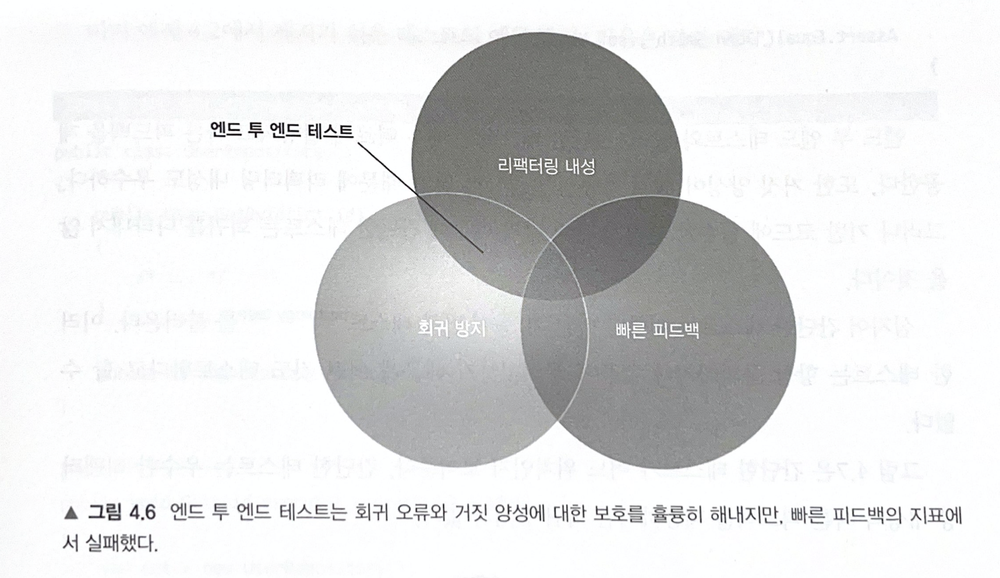
- 회귀방지 :white_check_mark:
  - 많은 코드를 테스트
  - 직접 작성한 코드뿐만 아니라 외부 라이브러리, 프레임워크 등 프로젝트에서 사용하는 코드를 가장 많이 수행
- 리팩터링 내성 :white_check_mark:
  - (리팩토링을 올바르게 했다면)식별할 수 있는 동작을 변경하지 않았기 때문에
- 빠른 피드백 :x:
### 4.4.3 간단한 테스트
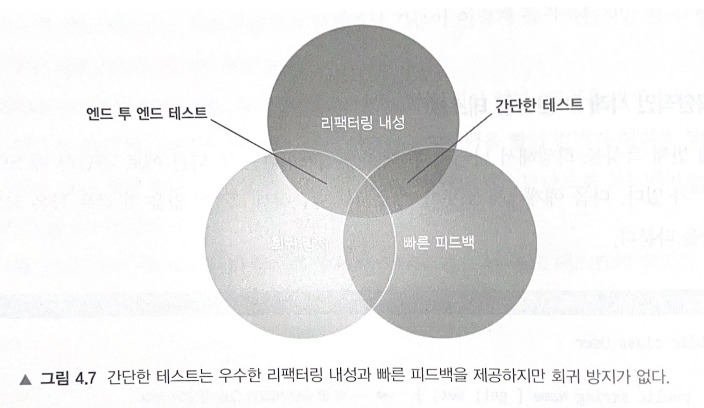
- 회귀방지 :x:
  - 테스트가 간단한 만큼 좁은 영역만 검증하기 때문에 그 외 엮여있는 비즈니스로직을 검증하지 못한다
- 리팩터링 내성 :white_check_mark:
  - 거짓 양성은 비즈니스 로직은 동작하지만 테스트가 실패하는 경우인데<br>
    간단한 테스트에서는 거짓 양성이 생길 가능성이 낮다
      - 비즈니스 로직이 동작하면서 테스트가 성공하거나
      - 비즈니스 로직이 실패하면서 테스트가 실패하거나
- 빠른 피드백 :white_check_mark:
### 4.4.4 깨지기 쉬운 테스트
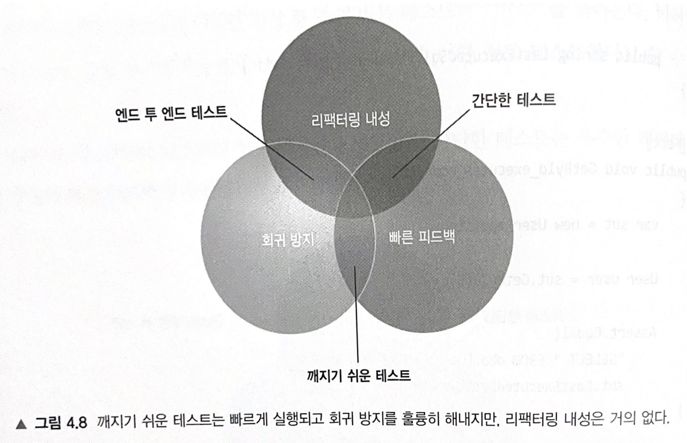
- 회귀 방지 :white_check_mark:
- 리팩터링 내성 :x:
  - 테스트가 구현에 결합된 경우
- 빠른 피드백 :white_check_mark:
### 4.4.5 이상적인 테스트를 찾아서
- 리팩터링 내성은 포기할 수 없다
- 테스트 스위트를 탄탄하게 하려면, 거짓 양성을 제거하는 것이 최우선
- 모든 테스트는 거짓 양성을 가능한 한 적게 하는 것을 목표

## 5. 목과 테스트 취약성
## 5.1 목과 스텁 구분
### 5.1.1 테스트 대역 유형
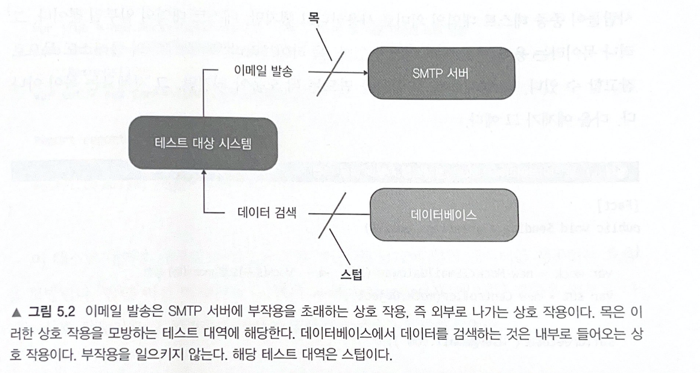
- 목
  - `외부로 나가는` 상호 작용을 `모방`하고 `검사`
- 스텁
  - `내부로 들어오는` 상호 작용을 `모방`
### 5.1.3 스텁으로 상호 작용을 검증하지 말라
> 스텁과의 상호 작용을 검증하는 것은 안티 패턴
- SUT에서 스텁으로의 호출은 SUT가 생성하는 최종 결과가 아니다
- 이러한 호출은 최종 결과를 산출하기 위한 수단일 뿐
```java
깨지기 쉬운 테스트

public void Creating_a_report() {
    var stub = new Mock<<IDatabase>>();
    stub.Setup(x => x.GetNumberOfUsers()).Returns(10);
    
    var sut = new Controller(stub.Object);
    
    Report report = sut.CreateReport();
    
    Assert.Equal(10, report.NUmberOfUsers);
    stub.Verify(
        x => x.GetNumberOfUsers(),
        Times.Once);
}
```
- GetNumberOfUsers()는 SUT가 비즈니스 로직을 처리하는것에 대한 내부 구현 세부 사항이다
- 결과가 올바르다면 SUT가 최종 결과를 어떻게 생성하는지는 중요하지 않다
### 5.1.4 목과 스텁 함께 쓰기
- 때로는 목과 스텁의 특성을 모두 나타내는 테스트 대역을 만들 필요가 있다
```java
public void Purchase_fails_When_not_enough_inventory() {
    var storeMock = new Mock<<IStore>>();
    storeMock
        .Setup(x => x.HasEnoughInventory(
            Product.Shampoo, 5))
        .Returns(false);
    var sut = new Customer();
    
    bool success = sut.Purchase(
        storeMock.Object, Product.Shampoo, 5);
    
    Assert.False(success);
    storeMock.Verify(
        x => x.RemoveInventory(Product.Shampoo, 5),
        Times.Never);
}
```
- `HasEnoughInventory()`에서 응답을 설정하고(스텁)<br>
`RemoveInventory()`에 대한 호출을 검증(목)
- 스텁과의 상호 작용을 검증하지 말라는 규칙을 위배하지 않는다
### 5.1.5 목과 스텁은 명령과 조회에 어떻게 연관돼 있는가?
> 목과 스텁의 개념은 명령 조회 분리(CQS)원칙과 관련<br>

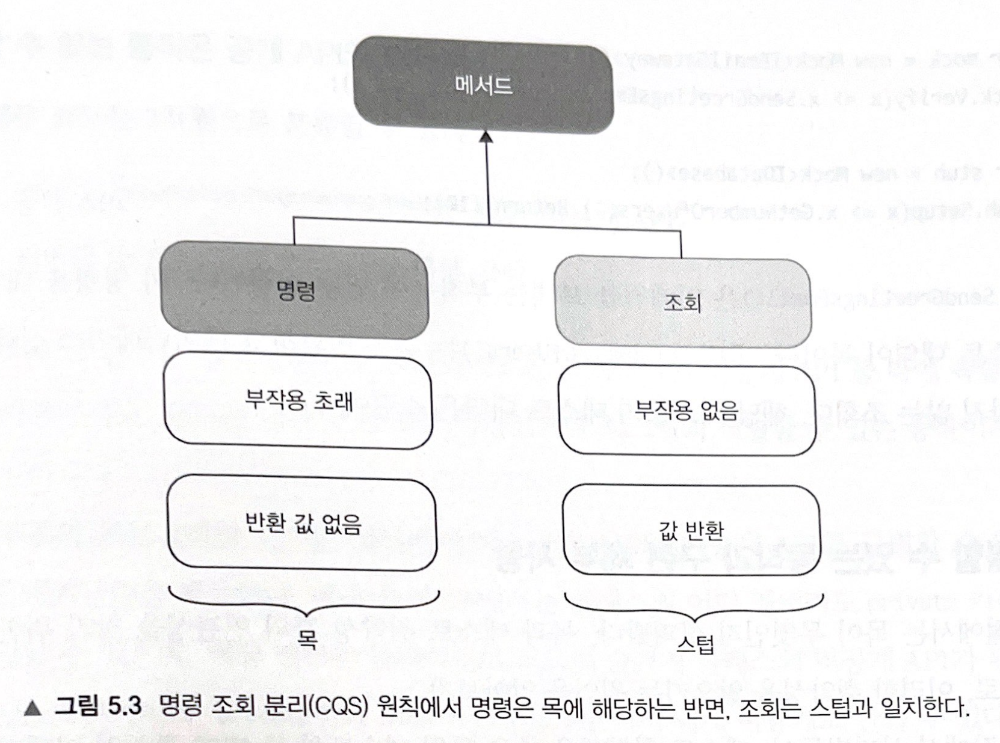
- 목 : 명령을 대체
- 스텁 : 조회를 대체
## 5.2 식별할 수 있는 동작과 구현 세부 사항
> 거짓 양성을 피하는 방법은 코드가 생성하는 최종 결과(식별할 수 있는 동작)를 검증하고<br>
> 구현 세부 사항과 테스트를 가능한 한 떨어뜨리는 것<br>
> 테스트는 `어떻게`가 아니라 `무엇`에 중점을 둬야 한다
### 5.2.1 식별할 수 있는 동작은 공개 API와 다르다
> 이상적으로 공개 API는 식별할 수 있는 동작과 일치해야 하며<br>
> 모든 세부 구현 사항은 클라이언트 눈에 보이지 않아야 한다<br>
> 이러한 시스템은 API 설계가 잘돼 있다
- 그러나 종종 공개 API가 구현 세부 사항을 노출하기 시작

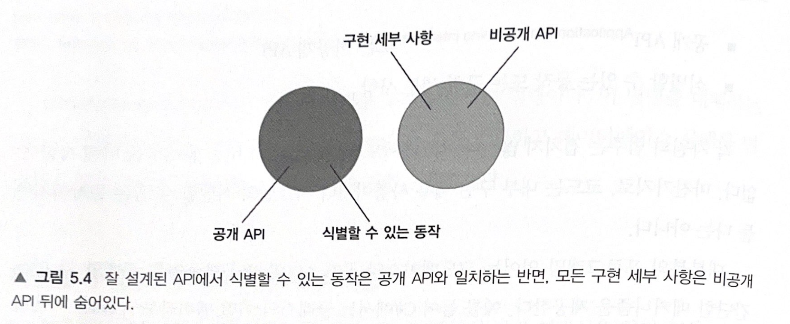
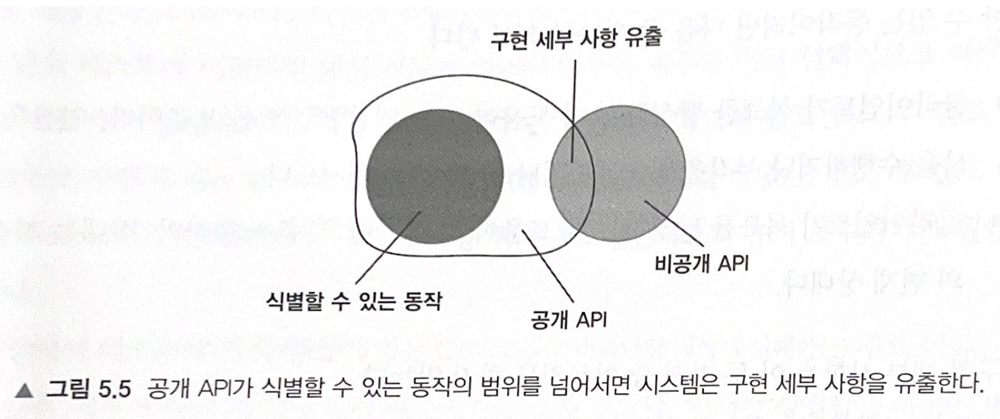
### 5.2.2 구현 세부 사항 유출 : 연산의 예
```java
public class User {
    public string Name { get; set; }
    
    public string NormalizeName(string name) {
        string result = (name ?? "").Trim();
        
        if (result.Length > 50)
            return result.Substring(0, 50);
        
        return result;
    }
}

public class UserController {
    public void RenameUser(int userId, string newName) {
        User user = GetUserFromDatabase(userId);
        
        string normalizedName = user.NormalizeName(newName);
        user.Name = normalizedName;
        
        SaveUser(user);
    }
}
```
- `RenameUser` 메서드의 목표는 사용자 이름을 변경하는 것
- `NormalizeName` 메서드도 작업이지만, 클라이언트의 목표에 직결되지 않는다
- `NormalizeName`은 클래스의 공개 API로 유출되는 구현 세부 사항이다
```java
public class User {
    private string _name;
    public string Name {
        get => _name;
        set => _name = NormalizeName(value);
    } 
    
    public string NormalizeName(string name) {
        string result = (name ?? "").Trim();
        
        if (result.Length > 50)
            return result.Substring(0, 50);
        
        return result;
    }
}

public class UserController {
    public void RenameUser(int userId, string newName) {
        User user = GetUserFromDatabase(userId);
        
        user.Name = newName;
        
        SaveUser(user);
    }
}
```
- 식별할 수 있는 동작(`Name 속성`)만 공개돼있고<br>
구현 세부 사항(`NormalizeName 메서드`)은 비공개 API로 숨긴다
> 클래스가 구현 세부 사항을 유출하는지 판단하는 데 도음이 되는 유용한 규칙<br>
> 단일한 목표를 달성하고자 클래스에서 호출해야 하는 연산의 수가 `1`보다 크면 해당 클래스에서 구현 세부 사항을 유출할 가능성
```java
string normalizedName = user.NormalizeName(newName);
user.Name = normalizedName;

>> 리팩토링 후 연산 수가 1로 감소
user.Name = newName;
```
### 5.2.4 구현 세부 사항 유출 : 상태의 예
```java
public class MessageRenderer : IRender {
    public IReadOnlyList<IRenderer> SubRenderers { get; }
        
    public MessageRenderer() {
        SubRenderers = new List<IRenderer> {
            new HeaderRenderer(),
            new BodyRenderer(),
            new FooterRenderer()
        };
    }
    
    public string Render(Message message) {
        return SubRenderers
            .Select(x => x.Render(message))
            .Aggregate("", (str1, str2) => str1 + str2);
    }
}
```
- 하위 렌더링 클래스 컬렉션(`SubRenderes`)이 `public`이다
- 이 컬렉션이 식별할 수 있는 동작인가?<br>
클라이언트의 목표가 HTML을 렌더링하는 것이라고 하면, 대답은 `아니오`다
- 클라이언트에게 필요한 클래스 멤버는 `Render 메서드`뿐이다
- 모든 구현 세부 사항을 비공개로 하면 테스트가 식별할 수 있는 동작을 검증하는 것 외에는 다른 선택지가 없으며<br>
이로 인해 리팩터링 내성도 좋아진다
- 클라이언트가 목표를 달성하는 데 직접적으로 도움이 되는 코드만 공개해야 한다
## 5.3 목과 테스트 취약성 간의 관계
### 5.3.2 시스템 내부 통신과 시스템 간 통신
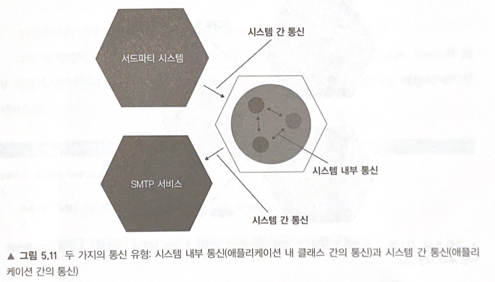
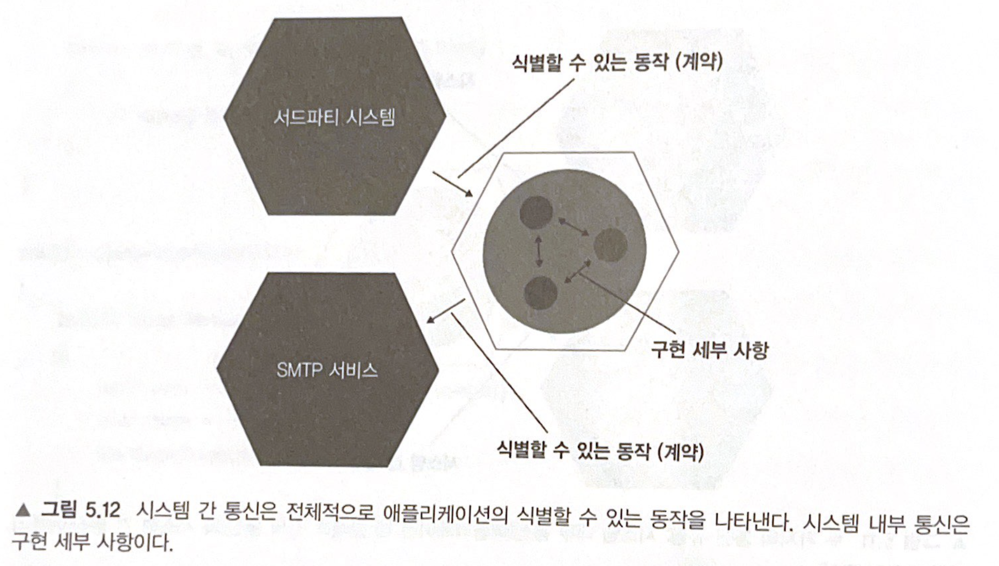

> 시스템 내부 통신은 구현 세부 사항이고, 시스템 간 통신은 그렇지 않다
- 연산을 수행하기 위한 도메인 클래스 간의 협력은 식별할 수 있는 동작이 아니기 때문에<br>
시스템 내부 통신은 구현 세부 사항에 해당된다
- 따라서, 이러한 협력과 결합하면 테스트가 취약해진다
- 시스템 외부 통신은 전체적으로 해당 시스템의 식별할 수 있는 동작
### 5.3.3 시스템 내부 통신과 시스템 간 통신의 예
```java
public class CustomerController {
    
    public bool Purchase(int customerId, int productId, int quantity) {
        Customer customer = customerRepository.getById(customerId);
        Product product = productRepository.getById(productId);
        
        bool isSuccess = customer.Purchase(
            _mainStore, product, quantity);
        
        if (isSuccess) {
            emailGateway.SendReceipt(
                customer.Email, product.Name, quantity);
        }
        
        return isSuccess;
    }
}
```
- 구매라는 동작은 시스템 내부 통신과 시스템 간 통신이 모두 있는 비즈니스 유즈케이스
```java
- 고객이 상점에서 제품을 구매하려고 한다
- 매장 내 제품 수량이 충분하면
    - 재고가 상점에서 줄어든다
    - 고객에게 이메일로 영수증을 발송한다
    - 확인 내역을 반환한다
```
- 시스템 `내부` 통신 : Customer와 Store 도메인 클래스 간의 통신
- 시스템 `외부` 통신 : CustomerController 애플리케이션 서비스와 두 개의 외부 시스템
  - 서드파티 애플리케이션
  - 이메일 게이트웨이
> 이 예제에서 SMTP 서비스에 대한 호출은 외부 환경에서 볼 수 있는 부작용이므로 애플리케이션 전체적으로 식별할 수 있는 동작이다
- 따라서, SMTP 서비스에 대한 호출을 목으로 처리하는 이유는 타당하다
- 리팩터링 후에도 이러한 통신 유형이 그대로 유지되어야 하기 때문에 테스트 취약성을 야기하지 않는다

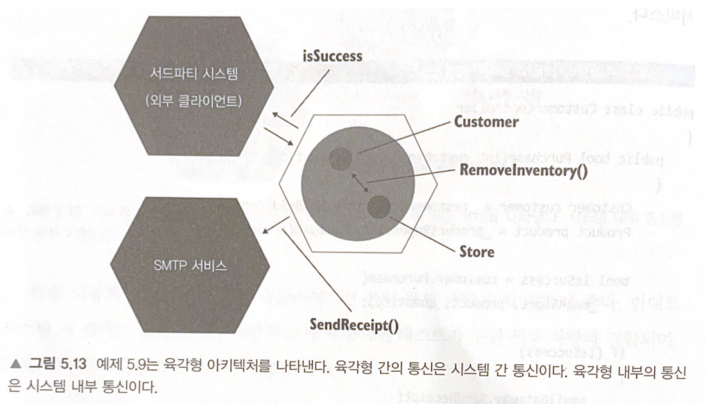
```java
시스템 외부 통신에 대한 타당한 목 사용

public void Successful_purchase() {
    var mock = new Mock<<IEmailGateway>();
    var sut = new CustomerController(mock.Object);
    
    bool isSuccess = sut.Purchase(
        customerId: 1, productId: 2, quantity: 5);
    
    Assert.True(isSuccess);
    mock.Verify(
        x => x.SendReceipt(
            "customer@email.com", "Shampoo", 5),
        Times.Once);
}
```
```java
시스템 내부 통신에 대한 목 사용 - 취약한 테스트로 이어진다

public void Purchase_succeeds_when_enough_inventory() {
    var storeMock = new Mock<<IStore>();
    storeMock
        .Setup(x => x.HasEnoughInventory(Product.Shampoo, 5))
        .Returns(true);
    var customer = new Customer();
    
    bool success = customer.Purchase(
        storeMock.Object, Product.Shampoo, 5);
    
    Assert.True(success);
    storeMock.Verify(
        x => x.RemoveInventory(Product.Shampoo, 5),
        Times.Once);
}
```
- Customer 클래스에서 Store 클래스로의 메서드 호출은 애플리케이션 경계를 넘지 않는다
## 5.4 단위 테스트의 고전파와 런던파 재고
### 5.4.1 모든 프로세스 외부 의존성을 목으로 대체 해야 하는 것은 아니다
- 공유 의존성 : 테스트 간에 공유하는 의존성
- 프로세스 외부 의존성 : 프로그램의 실행 프로세스 외에 다른 프로세스를 점유하는 의존성(`ex> 데이터베이스, 메세지 버스, SMTP 등`)
- 비공개 의존성 : 공유하지 않는 모든 의존성
> 모든 프로세스 외부 의존성을 목으로 대체 해야 하는 것은 아니다
- 의존성이 애플리케이션을 통해서만 접근할 수 있으면, 이러한 의존성과의 통신은 시스템에서 식별할 수 있는 동작이 아니다
- 실제로 외부에서 관찰할 수 없는 프로세스 외부 의존성은 애플리케이션의 일부로 작용한다
- 데이터베이스는 클라이언트의 시야에서 완전히 숨어있기 때문에 전혀 다른 저장 방식으로 대체할 수 있다
- 완전히 통제권을 가진 프로세스 외부 의존성에 목을 사용하면 깨지기 쉬운 테스트로 이어진다

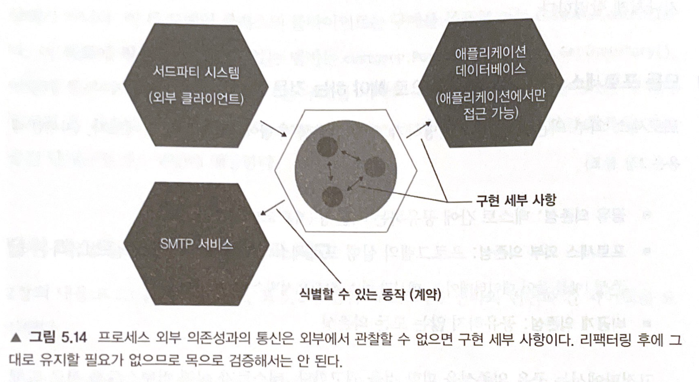
### 5.4.2 목을 사용한 동작 검증
> 목표를 달성하고자 각 개별 클래스가 이웃 클래스와 소통하는 방식은 식별할 수 있는 동작과 아무런 관계가 없다.<br>
> 즉, 이는 구현 세부 사항이다.

