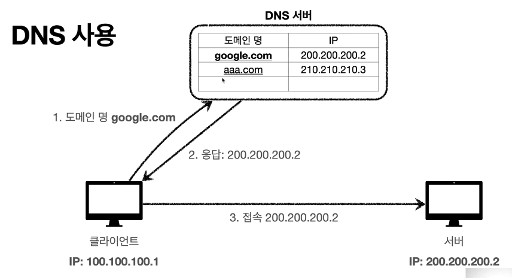

# 모든 개발자를 위한 HTTP 웹 기본 지식
- 인터넷 네트워크
    - IP
        - 지정한 IP 주소(IP Address)에 데이터 전달
        - 패킷이라는 통신 단위로 데이터 전달
        - 패킷정보
            - 출발지 IP
            - 도착지 IP
            - 전송데이터 등등
        - IP 프로토콜의 한계
            - 비연결성
                - 패킷을 받을 대상이 없거나 서비스 불능 상태여도 패킷 전송
            - 비신뢰성
                - 중간에 패킷이 사라지면?
                - 패킷이 순서대로 안오면?
            - 프로그램 구분
                - 같은 IP를 사용하는 서버에서 통신하는 애플리케이션이 둘 이상이면?
  
    - TCP
        - 프로토콜 계층

  
        - TCP/IP 패킷 정보

        - IP 패킷에 TCP 패킷정보를 추가해 IP만으로 해결하지 못했던 문제를 해결
  
        - TCP 특징
            - 연결지향 - TCP 3 way handshake
            - 데이터 전달 보증
            - 순서 보장
            
    - UDP
        - UDP 특징
            - 연결지향 - TCP 3 way handshake X
            - 데이터 전달 보증 X
            - 순서 보장 X
            - 데이터 전달 및 순서가 보장되지 않지만, 단순하고 빠름
    - PORT
        - 
      
    - DNS
        - 도메인 명을 IP주소로 변환
        - 