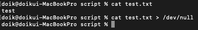
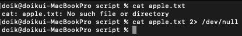

# 출력버리기

## 표준 출력 버리기
- 터미널에서 표준 출력이 표시되지 않게 하기 위한 방법으로 자주 사용
    ```shell script
    명령어 > /dev/null
    ```
    
<br><br>
## 표준 오류 버리기
- 표준 오류를 null 장치로 리다이렉션
    ```shell script
    명령어 2> /dev/null
    ```
    
<br><br>
## 표준 출력과 표준 출력장치 변경
- 표준 출력과 표준 오류 모두 null 장치로 보냄
    ```shell script
    명령어 > /dev/null 2>&1
    ```
1. `명령어 > /dev/null` : 표준 출력을 null 장치로 리다이렉션
2. `2>` : 파일 디스크립터 2번인 표준 오류를 리다이렉션
3. `&1` : 파일 디스크립터에서 표준 출력 1로 지정된 장치
- 표준 출력에 대한 리다이렉션 장치로 null 장치를 설정하고, 표준 오류에 대한 리다이렉션 장치를 표준 출력 장치로 설정함으로써 표준 출력과 표준 오류 모두 null 장치로 보냄
<br><br>
## null 장치(디바이스)
- null 장치(디바이스)는 기록 대상이 되는 모든 데이터를 버리지만 쓰기 작업은 성공했다고 보고하는 장치 파일
    ```shell script
    /dev/null
    ```
<br><br>
## 리다이렉션
### 표준 스트림
|표준 입력|stdin|파일 디스크립터 0|
|---|---|---|
|표준 출력|stdout|파일 디스크립터 1|
|표준 에러|stderr|파일 디스크립터 2|

<br><br>
### 표준 입력 리다이렉션
- 표준 입력 스트림에 대한 리다이렉션
    ```shell script
    명령어 < 파일
    ```
<br><br>
### 표준 출력 리다이렉션(새롭게 추가)
- 파일이 있으면 내용을 지우고 새로 내용을 추가
- 파일이 없으면 새로 파일을 만들어서 내용을 추가
    ```shell script
    명령어 > 파일
    ```
<br><br>
### 표준 출력 리다이렉션(기존 내용에 추가)
- 기존 파일내용을 지우지 않고 뒤에 이어서 추가
    ```shell script
    명령어 >> 파일
    ```
<br><br>
### 표준 오류 리다이렉션
- 표준 오류의 파일 디스크립터 2 명시
    ```shell script
    명령어 2> 파일
    ```
<br><br>
# reference
- [reference](https://minddoodle.tistory.com/10)